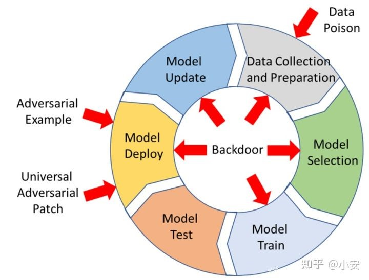
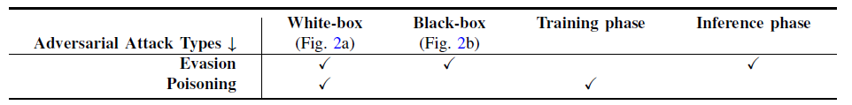

# Privacy and Security issues in machine learning
A worldview of security and privacy issues in machine learning.

# 0. Survey Paper or Introduciton or Blogs 
The most detailed review of this area is [AI sec Matrix from Tecent](https://matrix.tencent.com/en/) and its [pdf version](1.pdf). For most of paper, such as [SoK: Security and Privacy in Machine Learning (IEEE Europe S&P 2018)](https://ieeexplore.ieee.org/document/8406613), [Security and Privacy Issues in Deep Learning](https://arxiv.org/abs/1807.11655), they classify attacks as evasion attack (inference phase) and poisoning attack (training phase). In previous studies of evasion attack, attacks have typically been categorized as white-box or black-box attacks. Poisoning attacks can also be divided into white- and black-box attacks based on the model accessibility. Specifically, we categorize poisoning attacks into three subclasses based on the vulnerability of the target model: performance degradation, targeted poisoning, and backdoor attacks.

</img>

The particular thing is that Adversarial attack include two attacks: Evasion attack and poisoning attack. Adversarial machine learning, a technique that attempts to fool models with deceptive data.

</img>

Current DL systems additionally face the threat of privacy breach. There are considerable risks involved in training a DL model with data owned by multiple parties; for instance, in the case of deploying an application via a third-party cloud system. The potential privacy threats to DL-based systems arising from service providers, information silos and users. The most recent defense methods based on cryptography, such as homomorphic encryption, secure multiparty computation, and differential privacy.

# 1. Security issues in machine learning
Machine learning security is software security for machine learning systems. Like other types of software, machine learning software is at risk for security breaches and cyber attacks. Machine learning security is important because ML systems often contain confidential information or provide a competitive advantage to the organization that they would not want competitors to be able to access.
## 1.1 Survey paper and blogs
First, [Attacks-on-Machine-Learning](attacks.md) is a whole overview of attacks in machine learning. And I also produce some blogs related to [Backdoor learning](https://github.com/Billy1900/Backdoor-Learning). Plus, I also give some survey below.

- [Dataset Security for Machine Learning: Data Poisoning, Backdoor Attacks, and Defenses](https://arxiv.org/abs/2012.10544)
- Adversarial Attacks and defense
  - [Adversarial Attacks and Defences Competition](https://arxiv.org/pdf/1804.00097.pdf)
  - [The Threat of Adversarial Attacks on Machine Learning in Network Security -- A Survey](https://arxiv.org/abs/1911.02621)
  - [Adversarial Examples: Attacks and Defenses for Deep Learning](https://arxiv.org/abs/1712.07107)
  - [Adversarial Examples](https://arxiv.org/pdf/1806.04169.pdf)
## 1.2 Library
- [IBM: Adversarial Robustness Toolbox (ART) v1.3](https://github.com/IBM/adversarial-robustness-toolbox)
- [Implementation of membership inference and model inversion attacks, extracting training data information from an ML model. Benchmarking attacks and defenses.](https://github.com/Lab41/cyphercat)

# 2. Privacy issues in machine learning
The challenge for Congress is to pass privacy legislation that protects individuals against any adverse effects from the use of personal information in AI, but without unduly restricting AI development or ensnaring privacy legislation in complex social and political thickets. The discussion of AI in the context of the privacy debate often brings up the limitations and failures of AI systems, such as predictive policing that could disproportionately affect minorities or Amazon’s failed experiment with a hiring algorithm that replicated the company’s existing disproportionately male workforce. These both raise significant issues, but privacy legislation is complicated enough even without packing in all the social and political issues that can arise from uses of information. To evaluate the effect of AI on privacy, it is necessary to distinguish between data issues that are endemic to all AI, like the incidence of false positives and negatives or overfitting to patterns, and those that are specific to use of personal information.

The privacy protection can be divieded as two main parts: cryptography (MPC, HE) and differential privacy.
## 2.1 Survey paper and Blogs
First, I recommend this comprehensive survey [A Survey of Privacy Attacks in Machine Learning](https://arxiv.org/pdf/2007.07646.pdf) to start your privacy journey in AI. 

As for Differential privacy, I write a Differential private machine learning [tutorial](https://github.com/Billy1900/Awesome-Differential-Privacy). And here are several blogs to help you get hands on quickly, [Machine Learning with Differential Privacy in TensorFlow](http://www.cleverhans.io/privacy/2019/03/26/machine-learning-with-differential-privacy-in-tensorflow.html), [Differential Privacy with TensorFlow](https://blogs.rstudio.com/ai/posts/2019-12-20-differential-privacy/). And the workshop [Privacy machine learning workshop (CCS 2019)](https://ppml-workshop.github.io/) could help you get into this privacy AI field.
## 2.2 Library
- Differential privacy
  - [Pytorch: private machine learning](https://www.openmined.org/)
  - [TensorFlow World: Privacy-Preserving Machine Learning with TensorFlow](https://github.com/capeprivacy/tf-world-tutorial)
  - [Tensorflow Privacy](https://github.com/tensorflow/privacy)
  - [Pytorch-DP](https://github.com/facebookresearch/pytorch-dp)
  - [Diffprivlib: The IBM Differential Privacy Library](https://github.com/IBM/differential-privacy-library)
  - [Pysyft](https://github.com/OpenMined/PySyft)
  - [PyVacy: Privacy Algorithms for PyTorch](https://github.com/ChrisWaites/pyvacy)

